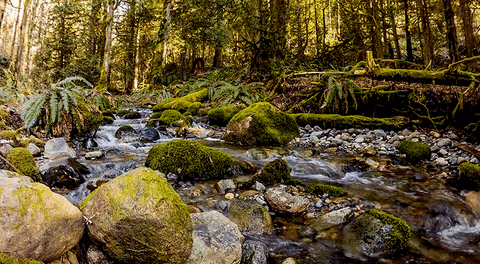

## 🌱 Data Science Student | 🌎 Passionate about Sustainability and Tech

I'm currently based in Vancouver, Canada, where I'm taking a Data Science program focused on tools like Python, SQL, PostgreSQL, Pandas, and Matplotlib. I originally come from a background in **Environmental Engineering**, where I worked on impactful projects related to **waste management and data collection** for major city events.

My journey into data science is fueled by a desire to combine technology with sustainable development. I'm passionate about uncovering insights from data that can drive meaningful change, especially in the context of **environmental recovery** and **climate-related challenges**.

At the moment, I am working on building my portfolio, which includes:

- 📊 A salary analysis project using SQL and Python (based on Kaggle data)
- 🗃️ SQL exercises using PostgreSQL and pgAdmin4
- 🌿 Researching environmental datasets focused on degraded land recovery
- 🎲 Designing an original sci-fi RPG universe called **Prospero**, where I combine storytelling and worldbuilding with scientific imagination. This personal project merges creativity and analytics, offering immersive narratives inspired by environmental transformation, alien ecosystems, and speculative technology.

* 🌍  I'm originally from Brazil and currently living in Vancouver
* 🧠  Learning: PostgreSQL, Python, SQL, Pandas, Matplotlib, Git, Django, Vue.js, Docker, PySpark, Hive, Hadoop
* 🤝  Open to collaboration on data-driven sustainability or tech-for-good projects
* ✨  Interested in roles that merge Data Science with Environmental Impact
* 💬  Multilingual: English | Portuguese (native) | Professional: Spanish 

### Skills

### Socials

### Badges

<!---
ALOBlack19/ALOBlack19 is a ✨ special ✨ repository because its `README.md` (this file) appears on your GitHub profile.
You can click the Preview link to take a look at your changes.
--->
